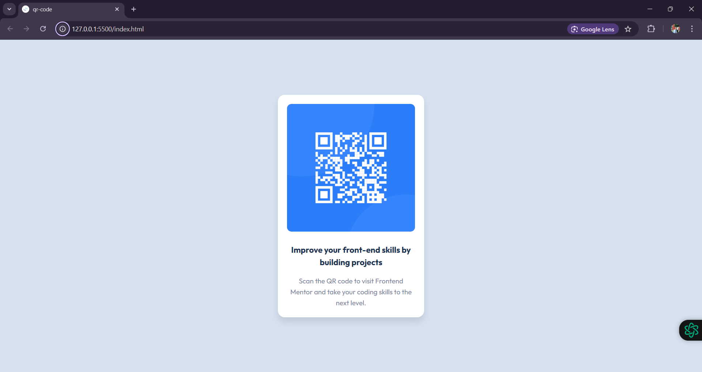

# **QR Code Component - Frontend Mentor Challenge**

This is my first project on **Frontend Mentor**, where I built a **QR Code Component** using **HTML** and **CSS**. The project helped me practice responsive design techniques and develop a better understanding of layout structures.

---

## **Project Overview**

### **Screenshot**
 

### **Links**
- **Live Site**: [https://qr-code-orcin-three.vercel.app/](#) 
- **Frontend Mentor Challenge**: [QR Code Component Challenge](https://www.frontendmentor.io/challenges/qr-code-component-iux_sIO_H) 

---

## **Features**
-  responsive design that adapts to mobile, tablet, and desktop screen sizes.
- Utilizes **CSS Flexbox** for layout alignment.

---

## **What I Used**
- **HTML5**
- **CSS3**
- **Flexbox**
- **Viewport Units (`vh` and `vw`)**
- **Google Fonts** (Font used: `Outfit`)

---

## **Learning Outcomes**
From this challenge, I learned:
1. How to use **Flexbox** for alignment and layout.
2. The importance of **viewport units** like `100vh` for full-height sections.
3. How to create a **mobile-first responsive design**.
4. Best practices for structuring HTML and styling CSS.

---

## **File Structure**
```
qr-code-component/
├── index.html        # HTML file
├── images/           # Folder containing images (e.g., QR code image),(SS.png)screenshot of the final output
└── README.md         # Project documentation
```

---

## **Responsive Design**
This project is responsive for:
- Mobile devices (375px width and above)
- Tablets
- Desktop screens

---

## **Challenges Faced**
1. Initially, I struggled to vertically center the component. I learned how to use `100vh` with **Flexbox** for proper alignment.
2. Ensuring the design matched the given mockups was tricky but improved my attention to detail.

---

## **Acknowledgments**
- Thank you to **Frontend Mentor** for providing such a great platform for practice.
- Special thanks to the **Frontend Mentor community** for inspiration and support.

---

Feel free to reach out with feedback or suggestions!

---

## **Author**
- **Frontend Mentor Profile**: [@azra316](https://www.frontendmentor.io/profile/azra316)
- **GitHub**: [GitHub](https://github.com/azra316)
- **Twitter**: [Twitter](https://x.com/Azra0369)
- **LinkedIn**: [LinkedIN](linkedin.com/in/azra-ah393)


---
